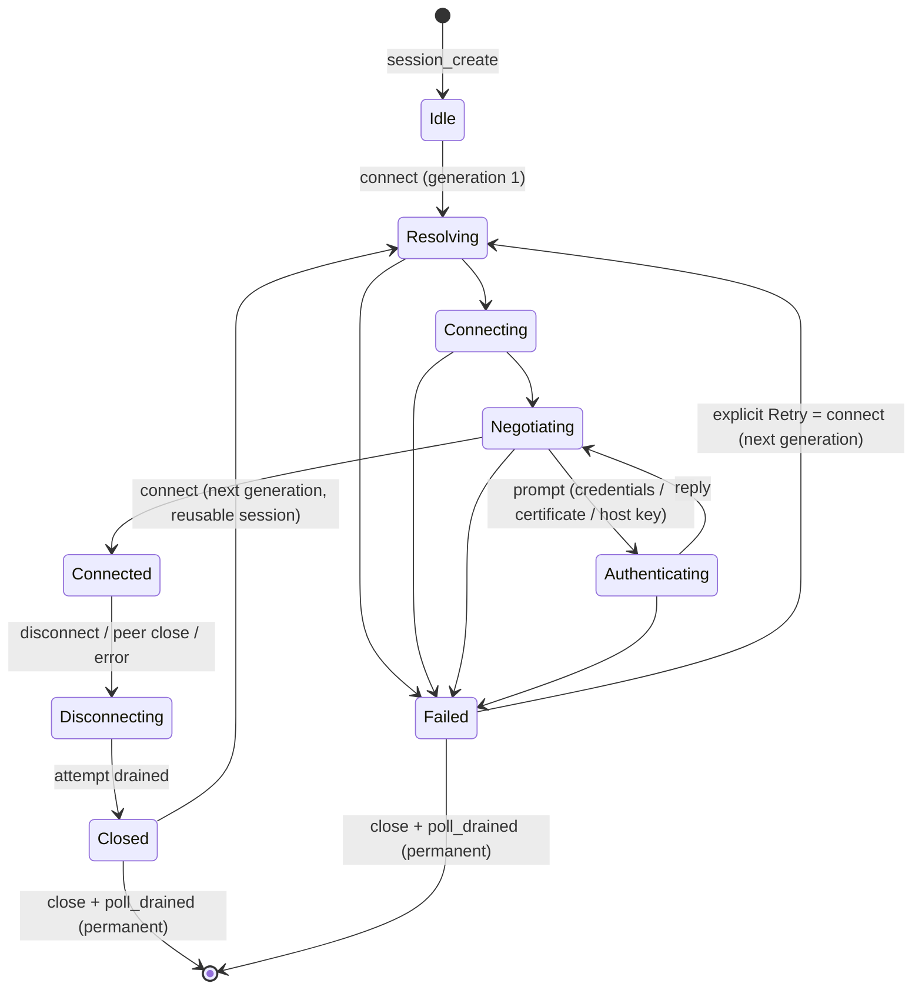

# Portable viewer interface handoff (for a future WinUI plan)

Updated 2026-09-23 (N6.14). This is the entry point for anyone building another
native frontend (for example WinUI) on the portable viewer core that the macOS
SwiftUI app uses. It summarizes the contracts and links to the authoritative
detail. **No Windows frontend, Windows service backend or Windows execution of the
native core is implemented or claimed.** The retained FLTK viewer remains the
Windows and Linux UI.

Authoritative references:

- C boundary: [`viewer/bridge/README.md`](../../viewer/bridge/README.md) and the
  header [`viewer/bridge/tidyvnc.h`](../../viewer/bridge/tidyvnc.h).
- Core services and ownership: [`viewer/README.md`](../../viewer/README.md) and
  [STATE-AUDIT.md](STATE-AUDIT.md).
- Parameters and precedence: [CAPABILITIES.md](CAPABILITIES.md), [CLI.md](CLI.md),
  [DOCUMENTS.md](DOCUMENTS.md).
- The macOS reference frontend: [`platform/macos/README.md`](../../platform/macos/README.md).

## Layers and dependency direction

```text
frontend (SwiftUI app / future WinUI app)
  └─ frontend platform layer (Swift TidyVNCNative / future C#/C++ layer)
       └─ tidyvnc_viewer_c        C ABI, handle registry, callback dispatcher
            └─ tidyvnc_viewer_core     sessions, listener, prompts, frames, input,
            │                          clipboard, settings grammars, documents
            └─ tidyvnc_viewer_platform socket connect/listen/transport, logging file
                 └─ rfbclient / network / rdr / core (shared with FLTK and servers)
```

The core and C targets never include FLTK, AppKit, SwiftUI, WinUI or X11.
`tests/viewer/headless.py` proves that from the generated CMake graph, and also
rejects any public-header include other than `stdint.h`/`stddef.h` or any
POSIX/Apple/Objective-C/Windows/widget or non-fixed-width type in `tidyvnc.h`.

Platform code in `viewer/platform` is POSIX (macOS and Linux). A Windows port
needs its own socket transport, connector (hostname lookup with cancellation),
listener source and private log file adapter behind the same internal interfaces
(`SessionTransport`, `ConnectionAttempt`, `ListenerSource`), plus Winsock start-up.

## C ABI conventions

- Version 1 (`TIDYVNC_ABI_VERSION`). Structs are zero-initialized with `size` and
  `version` set; unknown required feature bits are rejected. `tidyvnc_get_abi`
  advertises implemented features; check a bit before using its exports.
- Only fixed-width integers, `tidyvnc_bytes` / `tidyvnc_mutable_bytes` spans
  (pointer + 64-bit length) and opaque 64-bit handles. Text is UTF-8 without NUL,
  bounded (4096 bytes unless documented otherwise).
- Every export returns `tidyvnc_status` and never lets an exception escape. The
  optional `tidyvnc_error` carries domain, detail, native code and fixed,
  redacted text; server-provided or user-provided text is never copied into it.
- Failure, `NO_CHANGE` and `PENDING` leave outputs unchanged.
- Handles are registry IDs that are never reused. Stale, zero and wrong-kind handles
  return distinct statuses. Borrowed spans (image pixels, prompt fields, gateway
  fields) stay valid until the owning handle is released.

117 status-returning exports exist. The PLAN §4.2 command catalog maps to them as
recorded under N1.5 in [TODO.md](TODO.md).

## Session lifecycle



- Each connect creates a new **attempt generation**. Events, frames, prompts and
  completions carry their generation; frontends must drop stale ones
  (`subscription_validate` plus their own recheck on the UI executor).
- Every admitted operation reserves its completion before admission and completes
  exactly once (succeeded, failed or cancelled). Invalid-state commands are
  rejected synchronously with a status; UI disabling is not the only defense.
- Subscriptions start with the current snapshot, so there is no subscribe/connect
  race.
- Close/shutdown never joins on the caller. `session_poll_drained` and
  `runtime_poll_drained` report joined drain; release handles only after drain.

The listener has its own lifecycle (Starting, Listening, Stopping, terminal),
bounded incoming peers with expiry, explicit accept/reject and handoff of the
accepted transport into a configured reusable session. See "Reverse listener
ownership" in the bridge README.

## Threading and callbacks

- All commands and queries are callable from any thread and never wait for
  network, authentication or decoding. Protocol work runs on per-session workers.
- One shared dispatcher delivers coalesced readiness callbacks outside all locks.
  Callbacks must enqueue UI work and return promptly; they may take events, views
  and prompts, reply, issue commands and unsubscribe.
- The frontend must serialize delivery on its UI executor, own its captures, and
  recheck subscription identity and payload generation there. The Swift reference
  is `NativeDelivery`/`NativeSession` (one coalesced MainActor task).
- Measured on macOS: MainActor stays responsive (worst 5 ms tick gap 8–11 ms)
  during a pending connect, a 768 MiB raw decode flood and shutdown under load
  (N2.8).

## Data, input and prompts

- **Frames/cursor:** immutable leases with explicit format, stride, origin, damage,
  size generation and sequence, charged to bounded budgets. Old leases survive
  reconnect and destruction. Render with the shared tile renderer, damage mapping
  and cursor sampler exports; do not copy full desktops per view.
- **Input:** bounded key/pointer mailbox with coalescing, release-all on focus loss,
  overflow and disconnect, view-only enforced in core. Keys use physical IDs plus
  RFB keysyms and optional QEMU codes; the frontend maps its keyboard.
- **Prompts:** take a prompt handle, show UI, reply with prompt ID and generation.
  Credential spans are mutable and wiped on every return. Trust replies are
  explicit decisions; the core performs verification, and the frontend owns
  exception storage.
- **Clipboard:** bounded channel with independent send/receive policy,
  focus/generation routing and remote-origin echo suppression. The frontend owns
  the OS clipboard adapter and must serialize access to it.
- **Bell:** a per-attempt counter in the snapshot. The frontend sounds it; macOS
  rings once per delivery turn.

## Settings and parameters

The core owns grammar, validation and canonical form for the command line and
connection documents: the invocation catalog, encoding/security/scaling/window
geometry/logging, DesktopSize, ports and the SSH `via` grammar
(`TIDYVNC_FEATURE_PARAMETER_GRAMMARS`). The frontend owns:

- its typed configuration model over the layer composition (compiled → app
  defaults → profile → CLI → explicit file) and the two deprecated migrations
  (DotWhenNoCursor, FullScreenAllMonitors); see `NativeOptionOverlay`. The
  precedence, migrations and provenance are also in the core
  (`tidyvnc_config_resolve`, W2 of the WinUI plan);
- platform path policy for PasswordFile and X509CA/CRL (Windows needs drive/UNC
  rules);
- stores. Their identities (credential accounts, trust scopes, SSH route and
  intent digests) are the core's `tidyvnc_identity_digest`, byte-identical to
  the macOS values, which stay pinned by regression tests.

The Windows plan moved further shared policy into the core with conformance
cases under `tests/conformance` that the macOS Swift implementations must also
pass: legacy `x509_known_hosts` lookup, legacy monitor numbering, export
losses, and the defaults/history import projection (see the bridge README,
"Shared policy for the Windows frontend"). The macOS app keeps its Swift
implementations; switching it to these exports is optional.

## Services a frontend must provide

| Service | macOS reference (injected through `AppServices`) |
| --- | --- |
| Preferences (schema, revision, serialized writes) | `NativePreferencesStore` over `NativePreferencesBacking` |
| Profiles/history (private atomic files) | `NativeProfileHistoryStore` over `NativeAtomicFileBacking` |
| Credentials (OS secret store, no plaintext fallback) | `NativeCredentialStore` over `NativeCredentialBacking` (Keychain) |
| Trust (saved decisions, read-only legacy exceptions) | `NativeTrustStore`, `NativeLegacyTrustStore` |
| Documents/files (explicit, bounded, no main-thread IO) | `NativeDocumentReading`, `NativeDocumentWriting`, `NativePasswordFileReading` |
| Clipboard | `NativePasteboardAccess` + `NativeClipboardCoordinator` |
| Displays/windows/fullscreen/input capture | `NativeDisplaySource`, `NativeFullscreenWindows`, `NativeKeyboardCapturing` |
| Tunnel (SSH gateway process) | `NativeTunnelOwning` |
| Bell, logging, help, lifecycle/quit | `NativeBellSounding`, `NativeProcessLogging`, `AppCoordinator` |
| Permission guidance | typed issues (Local Network, Accessibility via `NativeKeyboardCaptureStart`) |

Each has typed errors. The N1.9 audit in TODO.md records what is intentionally
process-wide.

### Semantics a Windows backend must decide (not implemented)

These are open design notes, not requirements met by this repository:

- **Credentials:** Keychain semantics (distinct not-found/locked/denied/
  cancelled/interaction-required results, local-only items, no plaintext
  fallback) must map onto Credential Manager/DPAPI. Windows has no equivalent of
  the per-call "interaction not allowed" policy, so the adapter must say how it
  avoids surprise UI.
- **Preferences and stores:** macOS uses a UserDefaults domain for defaults and
  owner-only files under Application Support for profiles/history/trust.
  Windows needs per-user AppData files with equivalent atomic replace, conflict
  detection and ACLs; the registry is not a drop-in for the revisioned record.
- **Paths:** PasswordFile/X509 resolution must adopt drive/UNC and
  relative-to-working-directory rules; the POSIX "leading slash" policy does not
  apply.
- **Network privacy:** macOS Local Network consent has no Windows counterpart;
  firewall prompts for listening sockets are the nearest analog and need their
  own guidance text.
- **Input capture:** the macOS Accessibility-gated event tap maps to low-level
  keyboard hooks; typed "permission required" versus "failed" results should be kept.
- **Clipboard:** remote-provenance marking uses a private pasteboard type on
  macOS; Windows needs a registered clipboard format with the same echo
  suppression.
- **Tunnel:** the SSH helper and askpass flow assume OpenSSH on POSIX; Windows
  OpenSSH differs in helper invocation and socket paths.

## Reusable tests

- `tests/unit` (768 on macOS, 765 on Linux): core, protocol, prompts, frames,
  input, clipboard, listener, grammars and ABI boundaries (including per-position
  allocation failure and stale/wrong-kind handles). Uses only fake transports,
  schedulers and sinks, and runs unchanged on Linux.
- `tests/viewer`: `viewer-c-abi-smoke` (a pure C99 consumer of the ABI) and
  `viewer-core-smoke`.
- `tests/viewer/headless.py`: clean configure, dependency-graph and public-header
  audit, build and tests without any GUI toolkit.
- Sanitizers: the full suite passes under ASan+UBSan+LSan and TSan (Linux) and
  ASan+UBSan and TSan (macOS). The glibc resolver tests skip under TSan.
- Protocol baseline: `tests/integration/macos-scaling-smoke.py` drives an actual
  executable against a scripted RFB peer. A Windows port would need its own
  launcher and isolation.

A WinUI plan should start by making `headless.py` pass on Windows with MSVC,
implement the Windows transport/connector/listener adapters, and run the unit
suite and C smoke there before any UI work.
